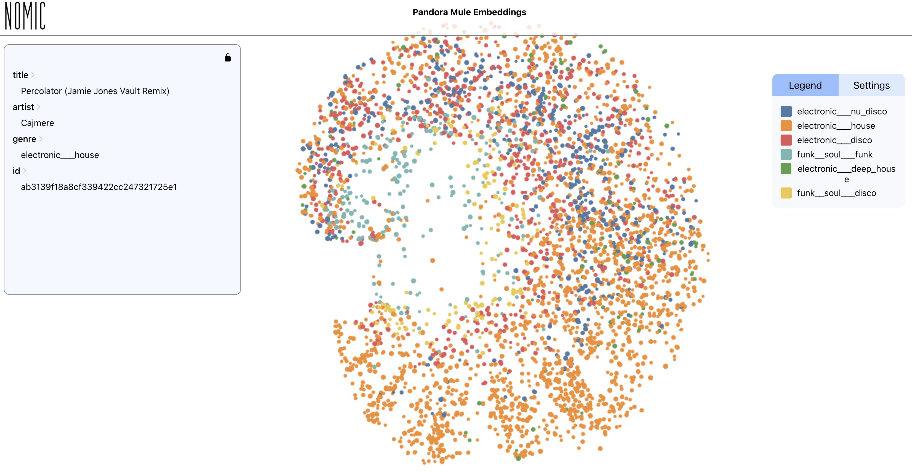
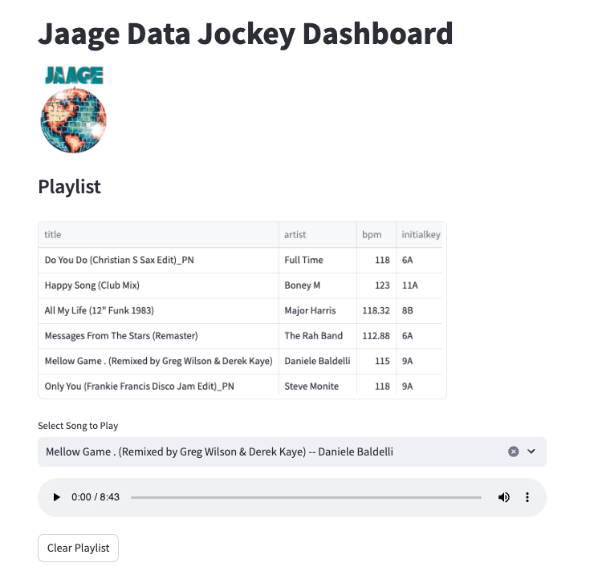
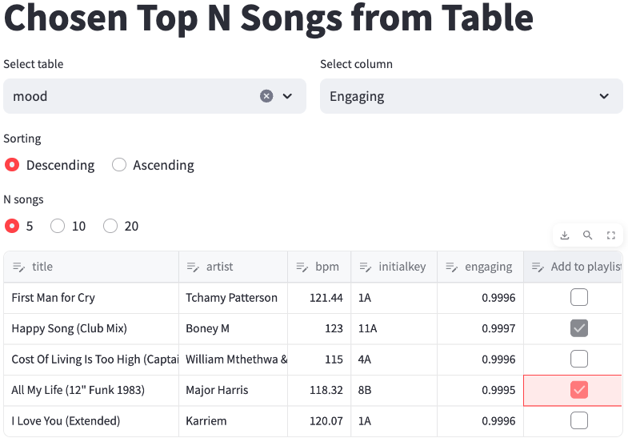
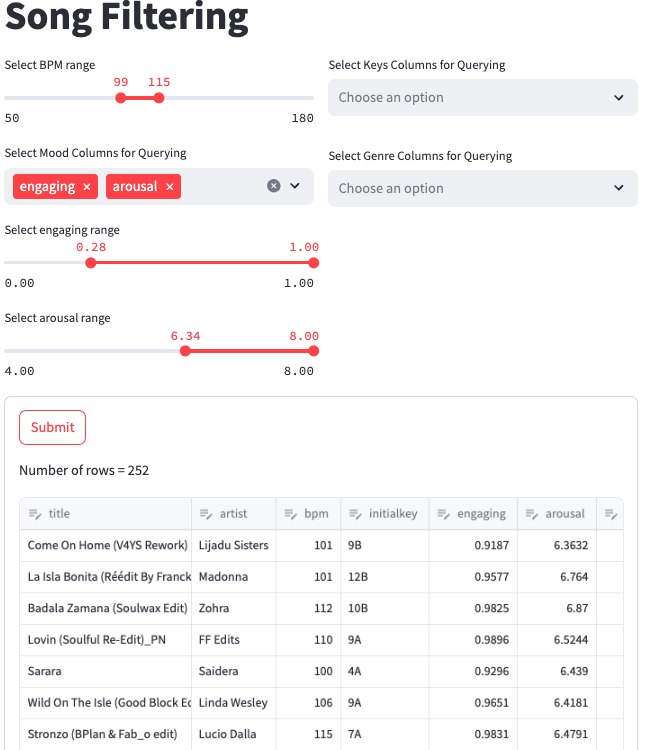
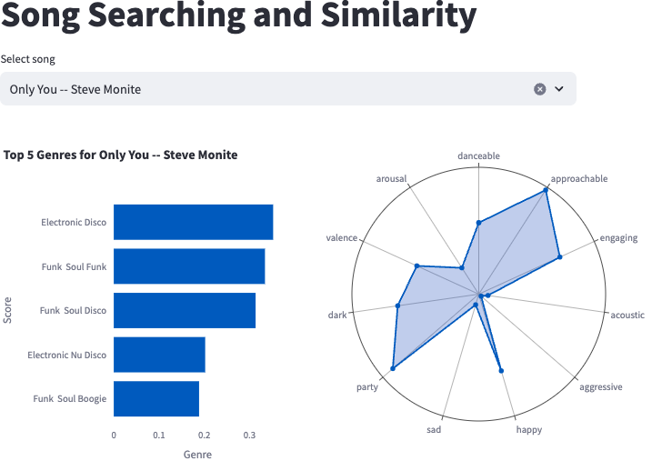
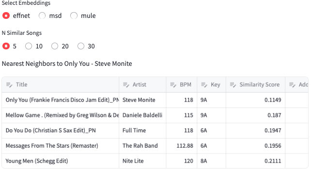
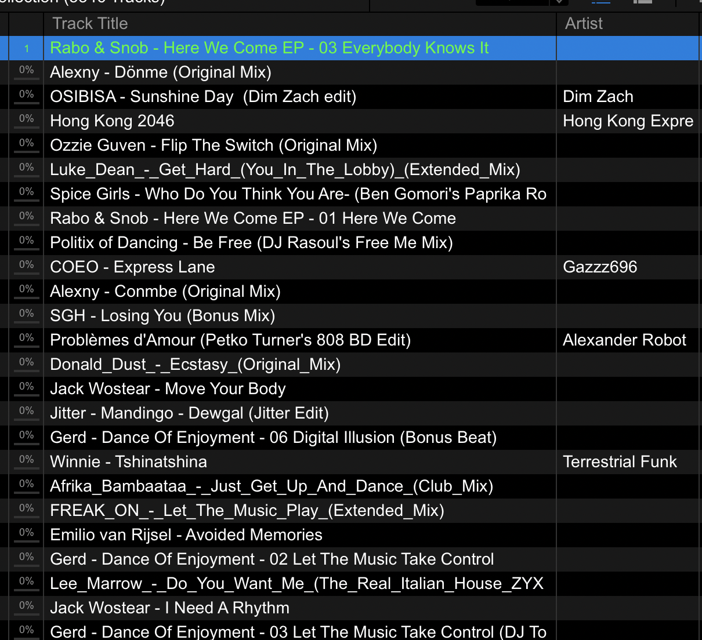
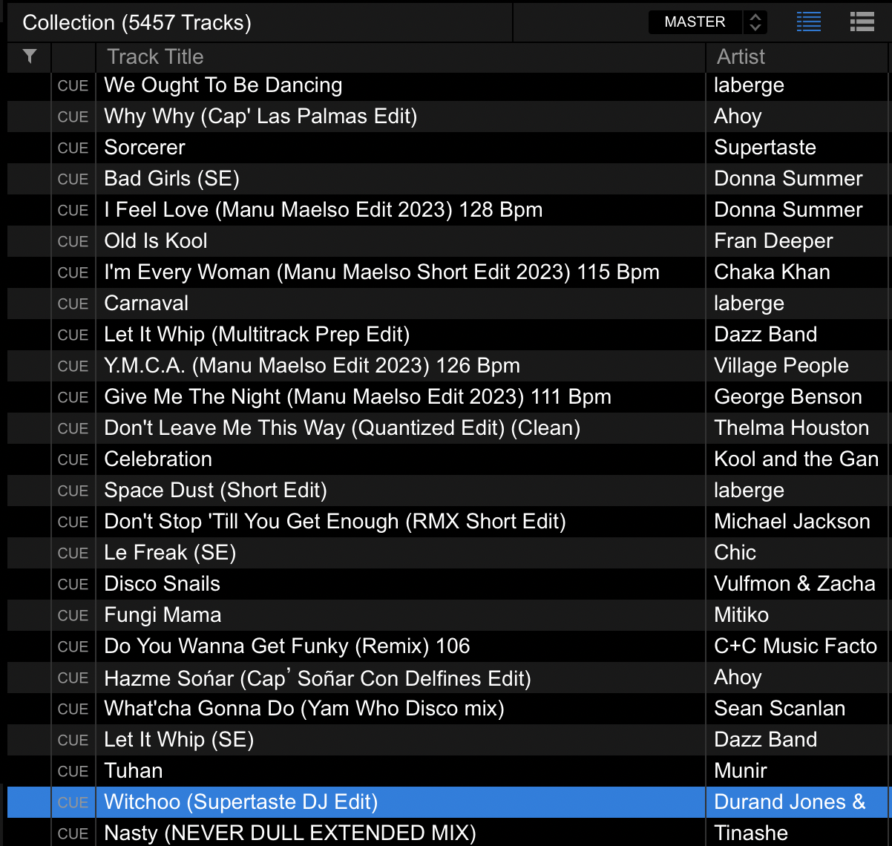

# Data Jockey 
## DJing with Data Science

### Introduction

Hi! My name is George McIntire aka [Jaage](https://www.instagram.com/jaage_dj/), I'm a data scientist by day and DJ by night. I play disco, funk, boogie, and house music from all over the world. You can check out my mixes on my [mixcloud](https://www.mixcloud.com/jaage/).

This is a passion project of mine that combines my two professions: data science and DJing. This project applies my data science expertise towards analyzing my collection of songs. With machine learning's increasing ability to process, synthesize, and even generate music, I became  inspired to dive in and see if big data algorithms could help me better understand my musical oeuvre and perhaps optimize my routine DJ activities.

### Project Overview

"Data Jockey" is a comprehensive and ongoing project that incorporates a wide variety of data tools and methodologies. I've been working on it in a part-time capacity since September 2022 and I am finally ready to publish the first stage of the project. 

The goal of this project is to see if I can meaningful impact my DJing career using my data science abilities. I'd like to be able to do things like:

- Build a recommendation engine that can effectively match similar songs. 
- Optimize the process of sifting through 1000s of songs to build playlists.
- Derive meaningful clusters from my music to add another dimension to music taxonomy

At the core of the project is [Essentia](https://essentia.upf.edu/), an "open-source library and tools for audio and music analysis, description and synthesis." I used to Essentia to process, extract data from, and classify the 4000 songs in my collection. I would like to express my gratitude to their team  for making this project happen.

Essentia has a [plethora of models](https://essentia.upf.edu/models.html) to choose from and for this project I decided to go with the the [Discogs-Effnet](https://essentia.upf.edu/models.html#discogs-effnet) models. This meant that I used the [Effnet](https://essentia.upf.edu/models/feature-extractors/discogs-effnet/discogs-effnet-bs64-1.json) model to derive embeddings from my music and then used other Effnet models finetuned for more specific purposes to classify my music based on a certain mood and style. I go into furher detail about the Essentia Effnet models work in my notebooks.

This repo holds the on-going analyses I conduct on the data extracted from Essentia's algorithms and models. The Notebooks directory contains a collection of annotated jupyter notebooks in which I narrate my data handling and analysis. I also uploaded a package I created for my project utility functions.

### Notebook Directory

- [Processor](Notebooks/Processor.ipynb): Explains the entire ETL process whenever I get a new batch of songs. The processor.py script is what I actually use for ETL, but I included this notebook so I could better explain the entire process. Process steps
    
    1. New unprocessed songs are kept in the `loading_dock` directory.
    2. Songs are mastered using [matchering](https://github.com/sergree/matchering) and then moved to the `collection` folder which holds all of my songs.
    3. Extract music features and metadata and then upload it to the jaage database.
    4. Generate embeddings and genre scores using the Effnet models and upload the data to the database.
    5. Classify new data using the collection of music [mood/style](https://essentia.upf.edu/models/classification-heads/) models.
     

- [EDA Part 1](Notebooks/EDA%Part%1.ipynb): This is a light exploratory data analysis where I take a cursory look at some of the data in my database.

- [EDA Effnet Genres](Notebooks/EDA%Effnet%Genres.ipynb): This is where I assess the efficacy of the models in classifying genre by conducting an eartest. For several genres, I sample 5-10 songs and assess the model's performance in appraising the "disco" or "funk" score of the songs.

- [EDA Style Classification](Notebooks/EDA%Style%Classification.ipynb): I repeat the same process I did for genres but this for mood and style scores such as danceability, engagement, approachability, and more.

- [RekordBox Cleaning and Munging](Notebooks/Rekord%20Box%20XML%20Data%20Cleaning%20and%20Munging.ipynb): Here I find a way to combine XML data exported from RekordBox with my database.

- [Song Similarity and Recommender](Notebooks/Song%20Similarity%20and%20Recommender.ipynb): Using the embeddings generate from the Effnet Discogs model and from Pandora's [MULE tool](https://github.com/PandoraMedia/music-audio-representations) I assess the efficacy of finding similar songs using euclidean and cosine distances.

- [Scenario Querying](Notebooks/Scenario%20Querying.ipynb): I use the mood/style scores to generate playlists for certain types of events. For example if I'm playing a nightclub, then I need to query my database for songs that have high dance and energy scores.
- [Unsupervised Learning - Dimensionality Reduction](Notebooks/Unsupervised%20Learning%20-%20Dimensionality%20Reduction.ipynb): I use dimensionality reduction methods to generate 2D maps of my song embeddings. This notebook includes links to two interactive plots generated using [Nomic](https://atlas.nomic.ai/)

### Project Milestone: The Data Jockey Dashboard

I am very happy to announce the latest update to the Data Jockey project: The Data Jockey Dashboard

I created a [Streamlit](https://streamlit.io/) app that provides easy and quick access to my database of songs and song data. The dashboard code can be found in the [dashboard directory](dashboard)

[Here's me explaining how the dashboard works](https://youtu.be/SaupmhroRy0)

Using this dashboard I can do things such as:

- Retrieve the top n songs for a chosen mood or genre score, for example the top 10 happy or nu-disco songs.

- Select songs based on a set of multiple conditions. The dashboard will display all the songs that meet a certain bpm, mood, or genre score. This provides a handy way to query songs based on DJing scenarios — see [Scenario Querying](Notebooks/Scenario%20Querying.ipynb) notebook of more information.
- Show graphs that display data associated with a song. 
- Return n most similar songs by having the option to query three different vector embedding databases.
- Every table output of songs has a checkbox next to each song that allows me to add that song to a playlist which shows up on the dashboard homepage, where I have the option to listen to that song.

Here are some screenshots of the dashboard in action

<!--      -->
<!--      -->
    
    

    
    

#### Project Update: LLM Metadata Extraction

Using ChatGPT, I developed a [tool](project_tools/llm.py) to extract and save metadata information from the paths of the new songs I import into my library. This is a extremely helpful tool because it saves me a significant amount from manually writing that information out in RekordBox. This [script](project_tools/llm.py) uses prompt engineering to guide ChatGPT in extracting the right information from each song path. I've successfully incorporated this tool into my [ETL pipeline](processor.py)

Here's what Rekordbox looks like right I import a new batch of songs. All of the artist names are blank or incorrect.

    

Now here's what Rekordbox after incorporating my LLM metadata extraction tool. Every song's artist and title information is correct.

    

If you have any suggestions/comments/questions please email me at geo.mcintire@gmail.com

    